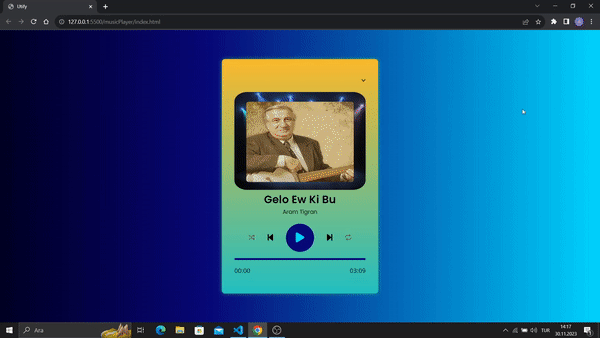

🚀 Utify - Minimalist Müzik Çalıcı 🚀

Utify, sade ve kullanıcı dostu arayüzü ile dikkat çeken bir müzik çalıcı uygulamasıdır. Bu proje, HTML, CSS ve JavaScript kullanılarak geliştirilmiştir.

🌟 Özellikler 🌟

- Şık ve minimalist tasarım
- MP3 dosyalarını çalabilme
- Oynatma listesi
- Şarkı detayları (isim, sanatçı)
- Temel ses kontrolü (oynat, duraklat, önceki, sonraki, karışık çalma, tekrar etme)

🌟 Kullanılan Teknolojiler 🌟
- HTML5
- CSS3
- JavaScript
- [Font Awesome](https://fontawesome.com/) - Simgeler için kullanılan ikon seti
- [Google Fonts](https://fonts.google.com/) - Yazı tipleri için kullanılan kaynak

🌟 Nasıl Kullanılır 🌟

1. Repo'yu bilgisayarınıza klonlayın.
2. `index.html` dosyasını tarayıcınızda açın.
3. Müziği kontrol etmek için butonları kullanın.
4. Dilerseniz oynatma listesini görüntüleyebilir ve şarkıları değiştirebilirsiniz.

🌐 Katılım 🌐

Bu projeye katkıda bulunmak istiyorsanız, lütfen [avcisalihoffical@gmail.com] bana ulaşabilirsiniz veya github hesabımı takip edin.  

🌐 Ekran Görüntüsü 🌐

